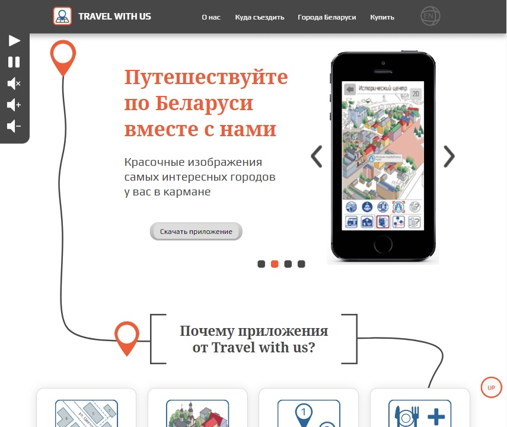

# Novogrudok-travel-app, промо-сайт туристического приложения (HTML | CSS | JS)

[Переключиться на английский | Switch to English](./README.md)

## О проекте
Промо-страница туристического приложения по г.Новогрудку, описывающая его сильные стороны и предоставляющее информацию о самом городе.

**Инструменты:** 

**Языки:** 
 
 
 
 

**Демо:** [Перейти на сайт](https://the-all-spark.github.io/Novogrudok-travel-app/)  

## Реализованный функционал:
1. предзагрузчик сайта в виде анимации (Adobe Animate CC);
2. панель управления звуковым сопровождением (кнопки воспроизведения музыки, паузы, отключения звука, увеличения и уменьшения громкости) (JS);
3. слайдер с экранами мобильного приложения (JS);
4. опрос-тест в блоке "Куда мне съездить?" (JS) - тест выдает название города и изображение:
   - если не выбрано ни одного пункта, отправка и очистка формы невозможны;
   - при выборе хотя бы одного пункта предупреждающее сообщение удаляется, кнопки "Отправить" и "Сбросить" становятся активными;
   - открытую форму можно закрыть, кликнув на иконку-"крестик" в верхнем правом углу (при этом, если форма была заполнена ранее, она очищается); 
   - при клике на кнопке "Сбросить" отменяется выделение пунктов опроса; 
   - после закрытия результата можно еще раз пройти опрос, кликнув по иконке "Reset".
5. форма обратной связи "Задать вопрос" (валидация с использованием библиотеки jQuery). После отправки формы выводится сообщение с благодарностью.
6. интегрирована Яндекс-карта с отмеченным городом Новогрудком (HTML);
7. интегрирован анимационный рекламный баннер (Adobe Animate CC);
8. адаптивная верстка (для ширины экрана от 1920 px до 350 px) (CSS).
