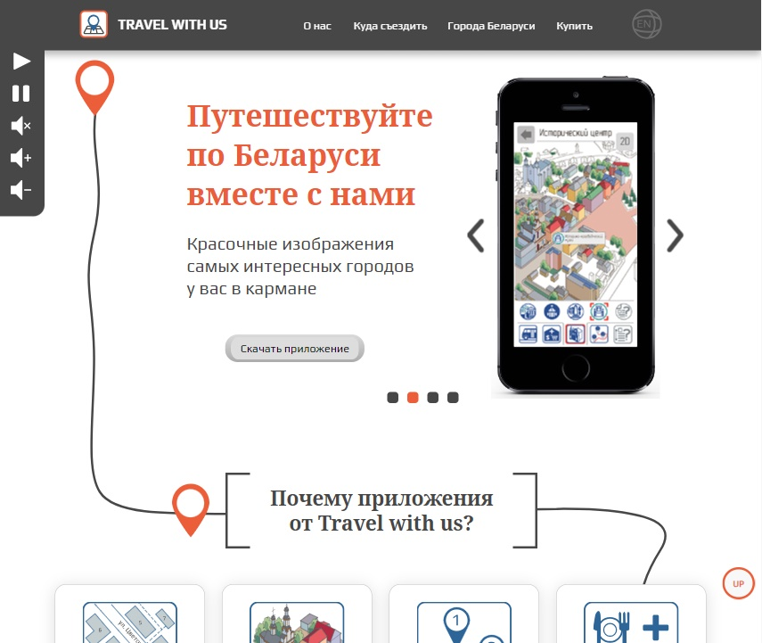

# Novogrudok-travel-app, promo site of travel app (HTML | CSS | JS)

[Switch to Russian | Переключиться на русский](./README-ru.md)

## About the project
A promotional page for the Novogrudok tourist app, describing its strengths and providing information about the city.

**Tools:**

**Stack:**  
 
 
 
 

**Demo:** [Link](https://the-all-spark.github.io/Novogrudok-travel-app/)  

## Realized functionality:
1. site preloader in the animation format (Adobe Animate CC);
2. sound control panel (buttons to play melody, pause, mute, increase and decrease volume) (JS);
3. slider with mobile application screens (JS);
4. survey-test in the "Where should I go?" section (JS);
5. feedback form "Ask a question" (jQuery library);
6. integrated Yandex-map with marked city Novogrudok on it (HTML);
7. integrated advertising banner (Adobe Animate CC). Displayed only when AdBlock is disabled.